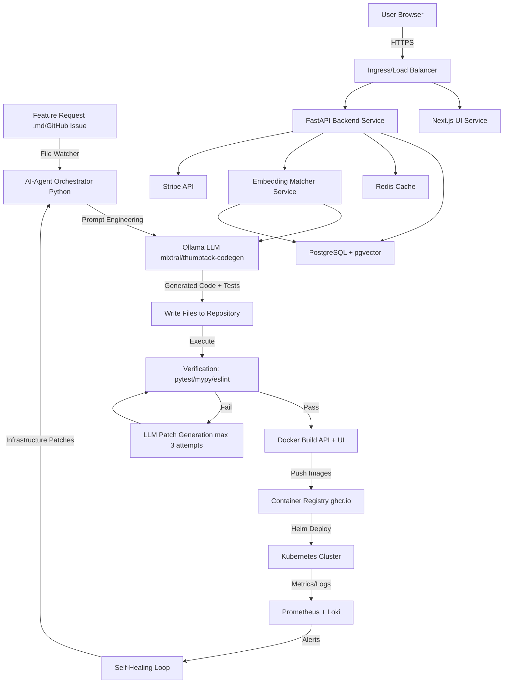
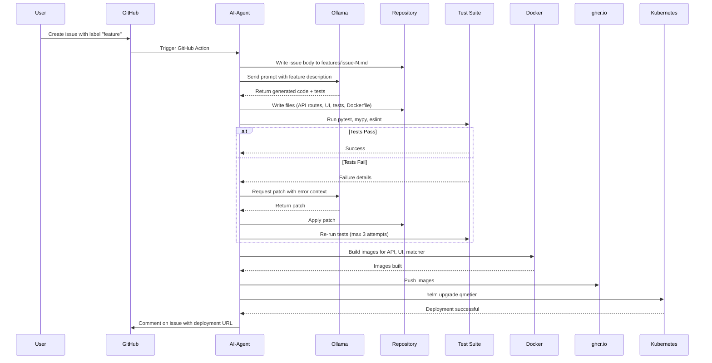
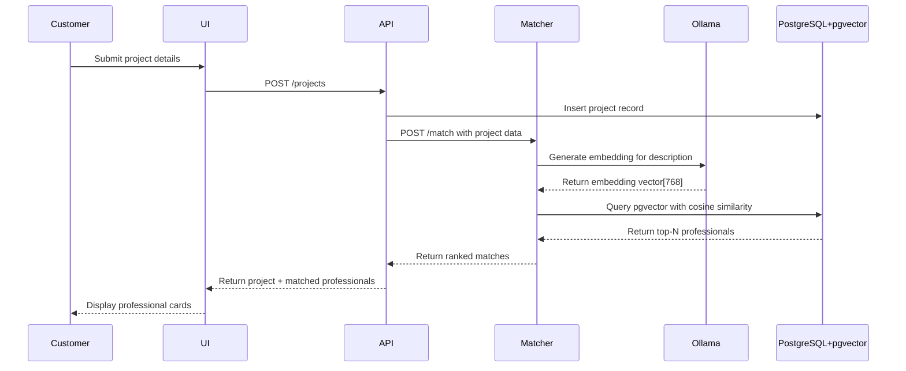
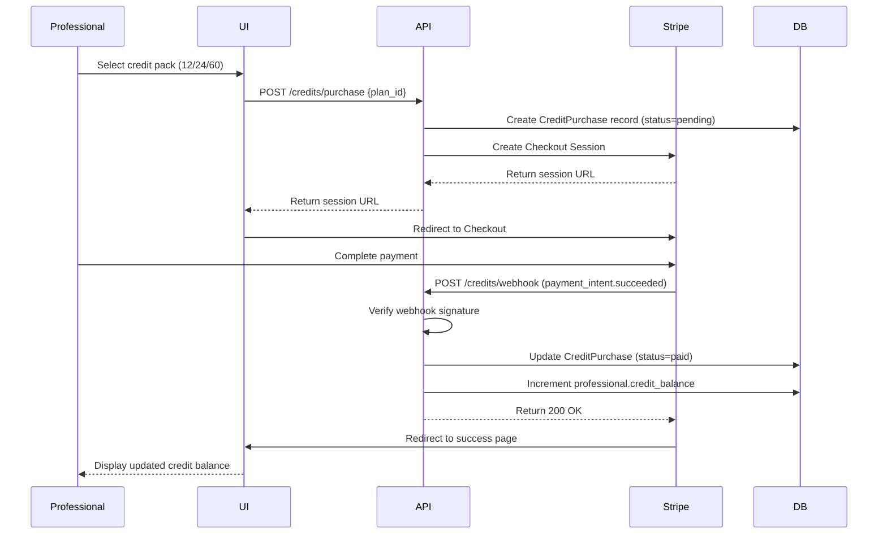
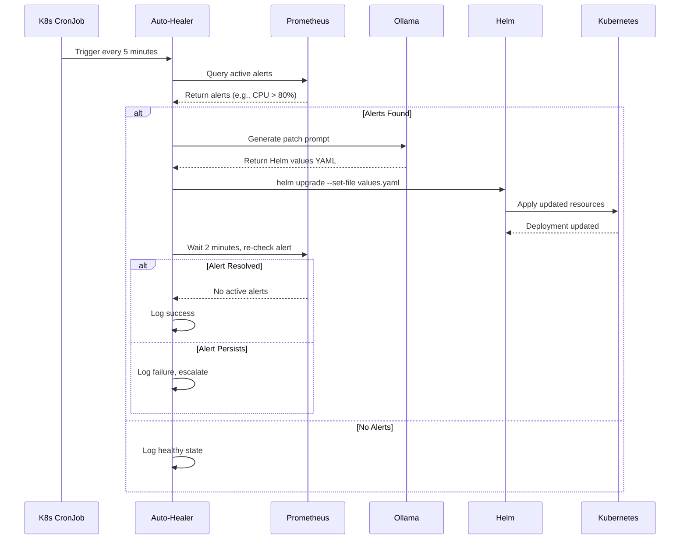

# Design Document: Q-MÉTIER AI-Autonomous Platform

## Overview

Q-MÉTIER is a fully AI-autonomous marketplace platform inspired by Thumbtack, where the entire software development lifecycle—from feature requests to production deployment—is handled by AI agents without manual intervention. The system leverages Ollama (local LLM) to generate, test, build, and deploy all code autonomously. The platform connects customers seeking services with professionals, using AI-powered matching via embeddings, credit-based quote systems, and self-healing infrastructure.

The core innovation is the AI-Agent Orchestrator that watches for feature requests, generates complete implementations (API routes, UI components, tests, infrastructure), verifies correctness, builds containers, and deploys to Kubernetes—all automatically. This creates a continuously evolving platform that improves itself based on user needs and operational metrics.

## Architecture



## Components and Interfaces

### Component 1: AI-Agent Orchestrator

**Purpose**: Autonomous orchestration engine that transforms natural language feature descriptions into deployed, production-ready code

**Interface**:
```python
class AIAgent:
    def call_ollama(self, prompt: str, model: str) -> str
    def extract_files(self, response: str) -> Dict[str, str]
    def write_files(self, files: Dict[str, str]) -> None
    def run_verification(self) -> Tuple[bool, str]
    def docker_build_and_push(self, services: List[str]) -> bool
    def helm_deploy(self, release_name: str, values: Dict) -> bool
    def process_feature(self, feature_path: str) -> bool
```

**Responsibilities**:
- Monitor features/ directory for new feature request markdown files
- Parse feature descriptions and build contextual prompts
- Call Ollama API to generate complete implementations
- Extract generated files from LLM response (parsing markdown code blocks)
- Write files to repository with proper directory structure
- Execute verification suite (unit tests, type checking, linting)
- Retry with LLM-generated patches if verification fails (max 3 attempts)
- Build Docker images for all services
- Push images to container registry
- Deploy to Kubernetes via Helm charts
- Log all operations for audit trail

### Component 2: Ollama LLM Stack

**Purpose**: Local language model infrastructure for code generation, embeddings, and brand-specific fine-tuning

**Interface**:
```python
class OllamaClient:
    def generate(self, model: str, prompt: str, system: str) -> str
    def embed(self, model: str, text: str) -> List[float]
    def create_model(self, name: str, modelfile: str) -> bool
    def pull_model(self, name: str) -> bool
```

**Responsibilities**:
- Serve base models (mixtral for code generation, nomic-embed-text for embeddings)
- Host custom models (thumbtack-codegen, qmetier-lora)
- Generate code from natural language descriptions
- Create embeddings for professional matching
- Support LoRA fine-tuning for brand-specific terminology

### Component 3: Backend API (FastAPI)

**Purpose**: RESTful API providing marketplace functionality for projects, quotes, credits, and professional management

**Interface**:
```python
# Projects Router
@router.post("/projects")
async def create_project(project: ProjectCreate, db: Session) -> Project

@router.get("/projects/{project_id}")
async def get_project(project_id: UUID, db: Session) -> Project

@router.get("/projects")
async def list_projects(skip: int, limit: int, db: Session) -> List[Project]

# Quotes Router
@router.post("/quotes")
async def submit_quote(quote: QuoteCreate, db: Session) -> Quote

@router.post("/quotes/{quote_id}/accept")
async def accept_quote(quote_id: UUID, db: Session) -> Quote

# Credits Router
@router.post("/credits/purchase")
async def purchase_credits(purchase: CreditPurchaseCreate, db: Session) -> StripeSession

@router.post("/credits/webhook")
async def stripe_webhook(request: Request, db: Session) -> Dict

# Professionals Router
@router.get("/professionals/{professional_id}")
async def get_professional(professional_id: UUID, db: Session) -> Professional

@router.put("/professionals/{professional_id}")
async def update_professional(professional_id: UUID, update: ProfessionalUpdate, db: Session) -> Professional
```

**Responsibilities**:
- Handle project creation, listing, and status management
- Process quote submissions and acceptances
- Integrate with Stripe for credit pack purchases
- Manage professional profiles and ratings
- Enforce credit-based access control
- Validate all inputs with Pydantic models
- Manage database transactions with SQLAlchemy

### Component 4: Frontend UI (Next.js)

**Purpose**: React-based user interface for customers and professionals to interact with the marketplace

**Interface**:
```typescript
// Pages
export default function HomePage(): JSX.Element
export default function ProjectWizardPage(): JSX.Element
export default function CreditsPage(): JSX.Element
export default function ProfessionalDashboard(): JSX.Element

// Components
interface StripeButtonProps {
  planId: string
  amount: number
  credits: number
  onSuccess: () => void
}
export function StripeButton(props: StripeButtonProps): JSX.Element

interface ProfessionalCardProps {
  professional: Professional
  onSelect: (id: string) => void
}
export function ProfessionalCard(props: ProfessionalCardProps): JSX.Element

interface QuoteFormProps {
  projectId: string
  onSubmit: (quote: QuoteData) => Promise<void>
}
export function QuoteForm(props: QuoteFormProps): JSX.Element
```

**Responsibilities**:
- Render landing page with marketplace overview
- Provide multi-step project creation wizard
- Display credit pack purchase options with Stripe integration
- Show professional profiles with ratings and reviews
- Handle quote submission and acceptance flows
- Manage client-side state with React hooks
- Communicate with backend API via fetch/axios

### Component 5: Embedding Matcher Service

**Purpose**: Real-time professional matching using semantic embeddings and vector similarity search

**Interface**:
```python
@app.post("/match")
async def match_professionals(request: MatchRequest, db: Session) -> MatchResponse

class MatchRequest(BaseModel):
    title: str
    description: str
    category_id: UUID
    skill_tags: List[str]
    lat: float
    lng: float
    max_distance_miles: float = 50
    top_n: int = 10

class MatchResponse(BaseModel):
    matches: List[ProfessionalMatch]

class ProfessionalMatch(BaseModel):
    id: UUID
    name: str
    rating: float
    review_count: int
    similarity: float
    distance_miles: float
```

**Responsibilities**:
- Generate embeddings for project descriptions using Ollama
- Query pgvector for similar professional embeddings
- Apply geographic filtering (PostGIS distance calculations)
- Rank results by cosine similarity
- Return top-N matched professionals
- Cache embeddings for performance

### Component 6: Self-Healing Loop

**Purpose**: Automatically detect and fix infrastructure issues using LLM-generated patches

**Interface**:
```python
class AutoHealer:
    def query_alerts(self) -> List[Alert]
    def generate_patch(self, alert: Alert) -> str
    def apply_patch(self, patch: str) -> bool
    def run_healing_cycle(self) -> None
```

**Responsibilities**:
- Query Prometheus for active alerts
- Build contextual prompts describing infrastructure issues
- Call Ollama to generate Helm values patches or Kubernetes manifests
- Apply patches via helm upgrade or kubectl apply
- Verify patch effectiveness by checking alert resolution
- Log all healing actions for audit

## Sequence Diagrams

### Feature Request to Deployment Flow



### Professional Matching Flow



### Credit Purchase Flow



### Self-Healing Flow



## Data Models

### Professional

```python
class Professional(BaseModel):
    id: UUID
    name: str
    email: EmailStr
    rating: float  # 0.0 to 5.0
    review_count: int
    embedding: List[float]  # 768-dimensional vector for pgvector
    location: Tuple[float, float]  # (latitude, longitude)
    skill_tags: List[str]
    credit_balance: int
    created_at: datetime
    updated_at: datetime
```

**Validation Rules**:
- email must be unique and valid format
- rating must be between 0.0 and 5.0
- review_count must be non-negative
- embedding must be exactly 768 dimensions
- latitude must be between -90 and 90
- longitude must be between -180 and 180
- credit_balance must be non-negative

### Project

```python
class Project(BaseModel):
    id: UUID
    title: str
    description: str
    category_id: UUID
    skill_tags: List[str]
    location: Tuple[float, float]
    status: ProjectStatus  # enum: open, matched, completed, cancelled
    customer_id: UUID
    matched_professional_id: Optional[UUID]
    created_at: datetime
    updated_at: datetime
```

**Validation Rules**:
- title must be 5-200 characters
- description must be 20-5000 characters
- skill_tags must have at least 1 tag
- status transitions: open → matched → completed (or open → cancelled)
- matched_professional_id required when status is matched or completed

### Quote

```python
class Quote(BaseModel):
    id: UUID
    project_id: UUID
    professional_id: UUID
    amount: Decimal  # USD amount
    credits_required: int
    message: str
    status: QuoteStatus  # enum: pending, accepted, rejected, expired
    created_at: datetime
    expires_at: datetime
```

**Validation Rules**:
- amount must be positive
- credits_required must be positive (typically 1-3 credits per quote)
- message must be 10-1000 characters
- expires_at must be after created_at (default: 7 days)
- professional must have sufficient credit_balance to submit quote

### CreditPurchase

```python
class CreditPurchase(BaseModel):
    id: UUID
    professional_id: UUID
    plan_id: str  # "12-pack", "24-pack", "60-pack"
    amount: Decimal  # USD amount paid
    credits: int  # Number of credits purchased
    stripe_session_id: str
    stripe_payment_intent_id: Optional[str]
    status: PurchaseStatus  # enum: pending, paid, failed, refunded
    created_at: datetime
    paid_at: Optional[datetime]
```

**Validation Rules**:
- plan_id must be one of: "12-pack", "24-pack", "60-pack"
- amount must match plan pricing (17.99, 34.99, 84.99)
- credits must match plan credits (12, 24, 60)
- stripe_session_id must be unique
- paid_at required when status is paid

**Credit Pack Pricing**:
| Plan ID | Credits | Price (USD) | Cost per Credit |
|---------|---------|-------------|-----------------|
| 12-pack | 12 | $17.99 | $1.50 |
| 24-pack | 24 | $34.99 | $1.46 |
| 60-pack | 60 | $84.99 | $1.42 |

### Category

```python
class Category(BaseModel):
    id: UUID
    name: str
    slug: str
    description: str
    icon_url: Optional[str]
    parent_id: Optional[UUID]  # For subcategories
```

**Validation Rules**:
- name must be unique
- slug must be unique and URL-safe
- parent_id must reference existing category (no circular references)

**Example Categories**:
- Home Improvement (Plumbing, Electrical, HVAC, Carpentry)
- Events (Photography, Catering, DJ, Event Planning)
- Wellness (Personal Training, Massage, Nutrition)
- Lessons (Music, Tutoring, Language, Art)
- Business (Accounting, Legal, Marketing, IT)

## Algorithmic Pseudocode

### AI-Agent Main Processing Algorithm

```pascal
ALGORITHM processFeature(featurePath)
INPUT: featurePath of type String (path to feature request markdown file)
OUTPUT: success of type Boolean

BEGIN
  ASSERT fileExists(featurePath) = true
  
  // Step 1: Read feature description
  featureContent ← readFile(featurePath)
  
  // Step 2: Build prompt with system context
  systemMessage ← "You are a senior full-stack engineer for Q-MÉTIER. Generate complete, production-ready code including API routes, UI components, tests, and Dockerfiles. Use FastAPI for backend, Next.js for frontend, and pytest for testing."
  prompt ← systemMessage + "\n\nFeature Request:\n" + featureContent
  
  // Step 3: Generate code via LLM
  response ← callOllama(prompt, MODEL)
  files ← extractFiles(response)
  
  ASSERT files.count > 0
  
  // Step 4: Write generated files
  FOR each (path, content) IN files DO
    writeFile(path, content)
  END FOR
  
  // Step 5: Verification loop with retry
  maxAttempts ← 3
  attempt ← 1
  
  WHILE attempt <= maxAttempts DO
    (passed, errors) ← runVerification()
    
    IF passed = true THEN
      BREAK
    ELSE
      IF attempt < maxAttempts THEN
        patchPrompt ← "The following tests failed:\n" + errors + "\n\nGenerate patches to fix these issues."
        patchResponse ← callOllama(patchPrompt, MODEL)
        patchFiles ← extractFiles(patchResponse)
        
        FOR each (path, content) IN patchFiles DO
          writeFile(path, content)
        END FOR
        
        attempt ← attempt + 1
      ELSE
        log("Verification failed after " + maxAttempts + " attempts")
        RETURN false
      END IF
    END IF
  END WHILE
  
  // Step 6: Build and deploy
  buildSuccess ← dockerBuildAndPush(["api", "ui", "matcher"])
  
  IF buildSuccess = false THEN
    RETURN false
  END IF
  
  deploySuccess ← helmDeploy("qmetier", {})
  
  RETURN deploySuccess
END
```

**Preconditions**:
- featurePath points to valid markdown file
- Ollama service is running and accessible
- Docker daemon is running
- Kubernetes cluster is accessible
- Repository has write permissions

**Postconditions**:
- All generated files are written to repository
- Tests pass (or max retry attempts exhausted)
- Docker images are built and pushed to registry
- Helm deployment is updated in Kubernetes
- Operation is logged

**Loop Invariants**:
- attempt <= maxAttempts throughout verification loop
- All previously written files remain in repository

### Professional Matching Algorithm

```pascal
ALGORITHM matchProfessionals(request)
INPUT: request of type MatchRequest
OUTPUT: matches of type List[ProfessionalMatch]

BEGIN
  ASSERT request.title ≠ empty
  ASSERT request.description ≠ empty
  ASSERT request.lat BETWEEN -90 AND 90
  ASSERT request.lng BETWEEN -180 AND 180
  
  // Step 1: Concatenate text for embedding
  searchText ← request.title + " " + request.description + " " + join(request.skill_tags, " ")
  
  // Step 2: Generate embedding
  embedding ← ollamaEmbed("nomic-embed-text", searchText)
  
  ASSERT length(embedding) = 768
  
  // Step 3: Query database with vector similarity and geographic filter
  query ← "
    SELECT 
      p.id, p.name, p.rating, p.review_count,
      1 - (p.embedding <=> $1) AS similarity,
      ST_Distance(p.location::geography, ST_MakePoint($2, $3)::geography) / 1609.34 AS distance_miles
    FROM professionals p
    WHERE 
      ST_DWithin(p.location::geography, ST_MakePoint($2, $3)::geography, $4 * 1609.34)
      AND p.credit_balance > 0
    ORDER BY similarity DESC
    LIMIT $5
  "
  
  results ← database.execute(query, [
    embedding,
    request.lng,
    request.lat,
    request.max_distance_miles,
    request.top_n
  ])
  
  // Step 4: Transform results
  matches ← []
  FOR each row IN results DO
    match ← ProfessionalMatch(
      id: row.id,
      name: row.name,
      rating: row.rating,
      review_count: row.review_count,
      similarity: row.similarity,
      distance_miles: row.distance_miles
    )
    matches.append(match)
  END FOR
  
  ASSERT length(matches) <= request.top_n
  
  RETURN matches
END
```

**Preconditions**:
- request contains valid title, description, coordinates
- Ollama embedding service is available
- Database has pgvector and PostGIS extensions enabled
- Professional embeddings are pre-computed

**Postconditions**:
- Returns at most top_n matches
- All matches are within max_distance_miles
- Matches are sorted by similarity (descending)
- All matched professionals have credit_balance > 0

**Loop Invariants**:
- All processed results have valid similarity scores (0.0 to 1.0)
- matches list never exceeds top_n size

### Credit Purchase Processing Algorithm

```pascal
ALGORITHM purchaseCredits(professionalId, planId)
INPUT: professionalId of type UUID, planId of type String
OUTPUT: sessionUrl of type String

BEGIN
  ASSERT planId IN ["12-pack", "24-pack", "60-pack"]
  
  // Step 1: Get plan details
  plans ← {
    "12-pack": {credits: 12, amount: 17.99},
    "24-pack": {credits: 24, amount: 34.99},
    "60-pack": {credits: 60, amount: 84.99}
  }
  
  plan ← plans[planId]
  
  // Step 2: Create purchase record
  purchase ← CreditPurchase(
    id: generateUUID(),
    professional_id: professionalId,
    plan_id: planId,
    amount: plan.amount,
    credits: plan.credits,
    status: "pending",
    created_at: now()
  )
  
  database.insert(purchase)
  
  // Step 3: Create Stripe Checkout Session
  stripeSession ← stripe.createCheckoutSession({
    mode: "payment",
    line_items: [{
      price_data: {
        currency: "usd",
        product_data: {
          name: planId + " Credit Pack",
          description: plan.credits + " credits for Q-MÉTIER"
        },
        unit_amount: plan.amount * 100
      },
      quantity: 1
    }],
    metadata: {
      purchase_id: purchase.id,
      professional_id: professionalId
    },
    success_url: BASE_URL + "/credits/success",
    cancel_url: BASE_URL + "/credits"
  })
  
  // Step 4: Update purchase with Stripe session ID
  purchase.stripe_session_id ← stripeSession.id
  database.update(purchase)
  
  RETURN stripeSession.url
END
```

**Preconditions**:
- professionalId exists in database
- planId is valid credit pack identifier
- Stripe API key is configured
- Database connection is active

**Postconditions**:
- CreditPurchase record created with status "pending"
- Stripe Checkout Session created
- Returns valid Stripe session URL
- No credits added to balance yet (awaits webhook confirmation)

**Loop Invariants**: N/A (no loops in this algorithm)

### Stripe Webhook Processing Algorithm

```pascal
ALGORITHM processStripeWebhook(payload, signature)
INPUT: payload of type String, signature of type String
OUTPUT: success of type Boolean

BEGIN
  // Step 1: Verify webhook signature
  event ← stripe.constructEvent(payload, signature, WEBHOOK_SECRET)
  
  IF event = null THEN
    log("Invalid webhook signature")
    RETURN false
  END IF
  
  // Step 2: Handle payment_intent.succeeded event
  IF event.type = "payment_intent.succeeded" THEN
    paymentIntent ← event.data.object
    sessionId ← paymentIntent.metadata.session_id
    
    // Step 3: Find purchase record
    purchase ← database.query("SELECT * FROM credit_purchases WHERE stripe_session_id = $1", [sessionId])
    
    IF purchase = null THEN
      log("Purchase not found for session: " + sessionId)
      RETURN false
    END IF
    
    // Step 4: Update purchase status
    purchase.status ← "paid"
    purchase.stripe_payment_intent_id ← paymentIntent.id
    purchase.paid_at ← now()
    database.update(purchase)
    
    // Step 5: Add credits to professional balance (atomic transaction)
    BEGIN TRANSACTION
      professional ← database.query("SELECT * FROM professionals WHERE id = $1 FOR UPDATE", [purchase.professional_id])
      professional.credit_balance ← professional.credit_balance + purchase.credits
      database.update(professional)
    COMMIT TRANSACTION
    
    log("Credits added: " + purchase.credits + " to professional: " + purchase.professional_id)
    
    RETURN true
  ELSE
    log("Unhandled event type: " + event.type)
    RETURN true
  END IF
END
```

**Preconditions**:
- payload is valid JSON from Stripe
- signature is valid Stripe signature header
- WEBHOOK_SECRET is configured
- Database supports transactions

**Postconditions**:
- Webhook signature is verified
- Purchase status updated to "paid"
- Credits atomically added to professional balance
- Operation is idempotent (safe to retry)

**Loop Invariants**: N/A (no loops in this algorithm)

### Self-Healing Algorithm

```pascal
ALGORITHM runHealingCycle()
INPUT: None
OUTPUT: healingActions of type List[HealingAction]

BEGIN
  healingActions ← []
  
  // Step 1: Query Prometheus for active alerts
  alerts ← prometheus.query("ALERTS{alertstate='firing'}")
  
  IF alerts.count = 0 THEN
    log("No active alerts - system healthy")
    RETURN healingActions
  END IF
  
  // Step 2: Process each alert
  FOR each alert IN alerts DO
    alertName ← alert.labels.alertname
    severity ← alert.labels.severity
    
    // Step 3: Build healing prompt
    prompt ← "Infrastructure Alert: " + alertName + "\n"
    prompt ← prompt + "Severity: " + severity + "\n"
    prompt ← prompt + "Description: " + alert.annotations.description + "\n\n"
    prompt ← prompt + "Generate a Helm values YAML patch to resolve this issue. "
    
    IF alertName CONTAINS "HighCPU" THEN
      prompt ← prompt + "Increase CPU limits by 50%."
    ELSE IF alertName CONTAINS "HighMemory" THEN
      prompt ← prompt + "Increase memory limits by 50%."
    ELSE IF alertName CONTAINS "HighErrorRate" THEN
      prompt ← prompt + "Increase replica count by 1."
    ELSE
      prompt ← prompt + "Suggest appropriate fix."
    END IF
    
    // Step 4: Generate patch via LLM
    response ← callOllama(prompt, MODEL)
    patch ← extractYAML(response)
    
    IF patch = null THEN
      log("Failed to generate patch for: " + alertName)
      CONTINUE
    END IF
    
    // Step 5: Apply patch
    patchFile ← "/tmp/patch-" + generateUUID() + ".yaml"
    writeFile(patchFile, patch)
    
    result ← executeCommand("helm upgrade qmetier ./infra/k8s/helm/qmetier --set-file " + patchFile)
    
    IF result.exitCode = 0 THEN
      action ← HealingAction(
        alert: alertName,
        patch: patch,
        status: "applied",
        timestamp: now()
      )
      healingActions.append(action)
      log("Applied patch for: " + alertName)
    ELSE
      log("Failed to apply patch for: " + alertName + " - " + result.stderr)
    END IF
    
    deleteFile(patchFile)
  END FOR
  
  // Step 6: Wait and verify
  sleep(120)  // Wait 2 minutes for changes to take effect
  
  FOR each action IN healingActions DO
    stillFiring ← prometheus.query("ALERTS{alertname='" + action.alert + "', alertstate='firing'}")
    
    IF stillFiring.count = 0 THEN
      action.status ← "resolved"
      log("Alert resolved: " + action.alert)
    ELSE
      action.status ← "failed"
      log("Alert persists: " + action.alert)
    END IF
  END FOR
  
  RETURN healingActions
END
```

**Preconditions**:
- Prometheus is accessible and configured
- Ollama service is running
- Helm and kubectl are installed
- Kubernetes cluster is accessible
- Sufficient permissions to modify deployments

**Postconditions**:
- All active alerts are processed
- Patches are generated and applied where possible
- Healing actions are logged
- Alert resolution is verified after 2-minute delay

**Loop Invariants**:
- healingActions list contains only processed alerts
- All applied patches have corresponding HealingAction records

## Key Functions with Formal Specifications

### Function: callOllama()

```python
def call_ollama(prompt: str, model: str = "mixtral", system: str = "") -> str
```

**Preconditions**:
- prompt is non-empty string
- model is valid Ollama model name
- OLLAMA_URL environment variable is set
- Ollama service is running and accessible

**Postconditions**:
- Returns generated text response from LLM
- Response is non-empty string
- HTTP connection is properly closed
- Raises OllamaError if service unavailable

**Loop Invariants**: N/A

### Function: extractFiles()

```python
def extract_files(response: str) -> Dict[str, str]
```

**Preconditions**:
- response is non-empty string containing markdown
- response contains code blocks with file path headers

**Postconditions**:
- Returns dictionary mapping file paths to content
- All paths are relative to repository root
- All content strings are valid UTF-8
- Empty dict if no files found (not an error)

**Loop Invariants**:
- All previously extracted files remain in result dict
- No duplicate file paths in result

### Function: runVerification()

```python
def run_verification() -> Tuple[bool, str]
```

**Preconditions**:
- Repository contains Python and TypeScript code
- pytest, mypy, eslint are installed
- Test files exist in appropriate directories

**Postconditions**:
- Returns (True, "") if all checks pass
- Returns (False, error_details) if any check fails
- error_details contains concatenated output from failed checks
- All test processes are terminated

**Loop Invariants**:
- All verification commands are executed in sequence
- Failure in one check does not prevent others from running

### Function: dockerBuildAndPush()

```python
def docker_build_and_push(services: List[str]) -> bool
```

**Preconditions**:
- services is non-empty list of service names
- Each service has corresponding Dockerfile
- Docker daemon is running
- Registry credentials are configured
- REGISTRY_URL environment variable is set

**Postconditions**:
- Returns True if all images built and pushed successfully
- Returns False if any build or push fails
- All successful images are available in registry
- Build cache is utilized for efficiency

**Loop Invariants**:
- All previously built services remain in registry
- Build failures do not affect already-pushed images

### Function: helmDeploy()

```python
def helm_deploy(release_name: str, values: Dict[str, Any]) -> bool
```

**Preconditions**:
- release_name is valid Helm release identifier
- Helm chart exists in infra/k8s/helm/qmetier/
- Kubernetes cluster is accessible
- kubectl context is set correctly
- values dict contains valid Helm values

**Postconditions**:
- Returns True if deployment successful
- Returns False if deployment fails
- Kubernetes resources are updated
- Previous deployment is rolled back on failure

**Loop Invariants**: N/A

### Function: ollamaEmbed()

```python
def ollama_embed(model: str, text: str) -> List[float]
```

**Preconditions**:
- model is valid embedding model (e.g., "nomic-embed-text")
- text is non-empty string
- Ollama service is running
- Model is pulled and available

**Postconditions**:
- Returns embedding vector of fixed dimension (768 for nomic-embed-text)
- All values are floats between -1.0 and 1.0
- Same input text always produces same embedding (deterministic)
- Raises OllamaError if service unavailable

**Loop Invariants**: N/A

## Example Usage

### Example 1: Creating a Feature Request

```python
# File: features/credit-pack-purchase.md
"""
# Q-MÉTIER Credit Pack Purchase

Professionals must be able to purchase credit packs to submit quotes.

## Requirements
- Display three credit pack options: 12 ($17.99), 24 ($34.99), 60 ($84.99)
- Integrate Stripe Checkout for payment processing
- Store purchase records in database
- Add credits to professional balance after successful payment
- Handle Stripe webhooks for payment confirmation

## API Endpoints
- POST /credits/purchase - Create Stripe Checkout Session
- POST /credits/webhook - Handle Stripe payment events

## UI Components
- CreditsPage with pack selection cards
- StripeButton component for checkout redirect

## Tests
- Unit tests for purchase creation
- Webhook signature verification
- Credit balance update logic
"""

# The AI-Agent will automatically:
# 1. Read this file
# 2. Generate FastAPI routes, Pydantic models, database migrations
# 3. Generate Next.js page and React components
# 4. Generate pytest tests
# 5. Build and deploy to production
```

### Example 2: Professional Matching

```python
# Client code calling the matcher service
import httpx

async def find_professionals(project_data: dict) -> list:
    async with httpx.AsyncClient() as client:
        response = await client.post(
            "http://matcher:8001/match",
            json={
                "title": project_data["title"],
                "description": project_data["description"],
                "category_id": project_data["category_id"],
                "skill_tags": project_data["skill_tags"],
                "lat": project_data["location"]["lat"],
                "lng": project_data["location"]["lng"],
                "max_distance_miles": 50,
                "top_n": 10
            }
        )
        response.raise_for_status()
        return response.json()["matches"]

# Example usage
project = {
    "title": "Fix leaking kitchen sink",
    "description": "My kitchen sink has been leaking for 2 days...",
    "category_id": "uuid-plumbing",
    "skill_tags": ["plumbing", "repair", "emergency"],
    "location": {"lat": 37.7749, "lng": -122.4194}
}

matches = await find_professionals(project)
# Returns: [
#   {"id": "uuid1", "name": "John's Plumbing", "rating": 4.8, "similarity": 0.92},
#   {"id": "uuid2", "name": "Quick Fix Pro", "rating": 4.6, "similarity": 0.87},
#   ...
# ]
```

### Example 3: Self-Healing in Action

```python
# Kubernetes CronJob runs this every 5 minutes
from scripts.auto_heal import AutoHealer

healer = AutoHealer(
    prometheus_url="http://prometheus:9090",
    ollama_url="http://ollama:11434",
    helm_chart_path="./infra/k8s/helm/qmetier"
)

# Automatically detects and fixes issues
actions = healer.run_healing_cycle()

# Example output:
# [
#   {
#     "alert": "HighCPUUsage",
#     "patch": "resources:\n  limits:\n    cpu: 1500m\n  requests:\n    cpu: 750m",
#     "status": "resolved",
#     "timestamp": "2024-01-15T10:30:00Z"
#   }
# ]
```

### Example 4: Complete Workflow

```python
# 1. User creates GitHub issue with label "feature"
# Title: Add professional ratings and reviews
# Body: """
# Customers should be able to rate professionals (1-5 stars) and leave text reviews
# after project completion. Display average rating and review count on professional cards.
# """

# 2. GitHub Action triggers AI-Agent
from scripts.ai_agent import AIAgent

agent = AIAgent(
    ollama_url="http://localhost:11434",
    model="thumbtack-codegen",
    repo_root="/workspace/qmetier"
)

# 3. Agent processes feature
success = agent.process_feature("features/issue-42.md")

# Agent automatically:
# - Generates Review model with rating, text, professional_id, customer_id
# - Creates POST /reviews endpoint with validation
# - Updates Professional model to include computed rating field
# - Generates ReviewCard React component
# - Writes pytest tests for rating calculation
# - Builds Docker images
# - Deploys to Kubernetes

# 4. Feature is live in production within 5 minutes
```

## Correctness Properties

### Property 1: Credit Balance Consistency
**Universal Quantification**: ∀ professional ∈ Professionals, ∀ time t: professional.credit_balance(t) = initial_balance + Σ(purchases) - Σ(quote_submissions)

**Verification**: 
- Database constraint: credit_balance >= 0
- Atomic transactions for all balance modifications
- Audit log for all credit operations

### Property 2: Quote Submission Authorization
**Universal Quantification**: ∀ quote ∈ Quotes: quote.status = "pending" ⟹ professional(quote.professional_id).credit_balance >= quote.credits_required

**Verification**:
- Pre-submission balance check in API endpoint
- Database transaction with SELECT FOR UPDATE
- Reject quote if insufficient credits

### Property 3: Embedding Dimension Consistency
**Universal Quantification**: ∀ professional ∈ Professionals: length(professional.embedding) = 768

**Verification**:
- Database constraint on vector column
- Validation in embedding generation function
- Type checking with mypy

### Property 4: Payment Idempotency
**Universal Quantification**: ∀ webhook_event ∈ StripeWebhooks: processing(webhook_event) multiple times ⟹ credits added exactly once

**Verification**:
- Check purchase.status before processing
- Atomic status update with database transaction
- Stripe event ID deduplication

### Property 5: Matching Relevance
**Universal Quantification**: ∀ match ∈ MatchResults: match.similarity ∈ [0.0, 1.0] ∧ match.distance_miles <= max_distance_miles

**Verification**:
- Cosine similarity formula guarantees [0, 1] range
- PostGIS ST_DWithin enforces distance constraint
- Unit tests verify boundary conditions

### Property 6: Feature Deployment Atomicity
**Universal Quantification**: ∀ feature ∈ Features: deployment(feature) succeeds ⟹ (tests_pass ∧ images_built ∧ helm_applied) ∨ deployment(feature) fails ⟹ previous_version_unchanged

**Verification**:
- Verification gate before build step
- Helm rollback on deployment failure
- Health checks before marking deployment complete

### Property 7: Self-Healing Convergence
**Universal Quantification**: ∀ alert ∈ ActiveAlerts: healing_applied(alert) ∧ wait(2_minutes) ⟹ alert.state = "resolved" ∨ escalate(alert)

**Verification**:
- Post-healing alert verification
- Escalation after failed healing attempts
- Monitoring of healing success rate

## Error Handling

### Error Scenario 1: LLM Generation Failure

**Condition**: Ollama service unavailable or returns invalid response

**Response**: 
- Catch connection errors and timeout exceptions
- Log error with full context (prompt, model, timestamp)
- Return error status to caller

**Recovery**:
- Retry with exponential backoff (3 attempts)
- Fall back to alternative model if available
- Alert operations team if persistent failure

### Error Scenario 2: Test Verification Failure

**Condition**: Generated code fails pytest, mypy, or eslint checks

**Response**:
- Capture full error output from test runners
- Build patch prompt with error context
- Request LLM to generate fixes

**Recovery**:
- Apply patches and re-run tests (max 3 attempts)
- If all attempts fail, mark feature as failed
- Preserve generated code for manual review
- Notify via GitHub issue comment

### Error Scenario 3: Insufficient Credits

**Condition**: Professional attempts to submit quote without sufficient credit balance

**Response**:
- Return 402 Payment Required status code
- Include current balance and required credits in error message
- Suggest credit pack purchase

**Recovery**:
- Redirect user to credits purchase page
- Preserve quote draft for submission after purchase
- Display clear messaging about credit requirements

### Error Scenario 4: Stripe Webhook Signature Verification Failure

**Condition**: Webhook payload signature does not match expected signature

**Response**:
- Return 400 Bad Request immediately
- Log security event with payload hash and signature
- Do not process payment

**Recovery**:
- Alert security team for investigation
- Verify webhook secret configuration
- Customer can retry payment (Stripe will resend webhook)

### Error Scenario 5: Database Connection Loss

**Condition**: PostgreSQL connection drops during transaction

**Response**:
- Catch database connection errors
- Roll back any partial transactions
- Return 503 Service Unavailable

**Recovery**:
- Retry with connection pool refresh
- Implement circuit breaker pattern
- Fall back to read replica for read operations
- Alert operations team if persistent

### Error Scenario 6: Docker Build Failure

**Condition**: Docker image build fails due to dependency issues or syntax errors

**Response**:
- Capture full build log
- Parse error messages for root cause
- Return build failure status

**Recovery**:
- Request LLM to fix Dockerfile or dependency files
- Retry build with patched files
- If persistent, fall back to last known good image
- Deploy previous version to maintain service

### Error Scenario 7: Kubernetes Deployment Failure

**Condition**: Helm deployment fails due to resource constraints or configuration errors

**Response**:
- Capture Helm error output
- Check pod status and events
- Trigger automatic rollback

**Recovery**:
- Helm automatically rolls back to previous release
- Self-healing loop may adjust resource limits
- Alert operations team with deployment logs
- Feature remains in pending state for retry

### Error Scenario 8: Embedding Generation Timeout

**Condition**: Ollama embedding service takes too long to respond

**Response**:
- Set 30-second timeout on embedding requests
- Return timeout error to caller
- Log slow embedding generation

**Recovery**:
- Retry with shorter text (truncate description)
- Fall back to keyword-based matching
- Cache embeddings to avoid regeneration
- Scale Ollama service if persistent timeouts

## Testing Strategy

### Unit Testing Approach

**Framework**: pytest for Python, Jest for TypeScript

**Coverage Goals**: Minimum 80% code coverage for all services

**Key Test Categories**:

1. **API Endpoint Tests**
   - Test all HTTP methods (GET, POST, PUT, DELETE)
   - Validate request/response schemas with Pydantic
   - Test authentication and authorization
   - Test error responses (400, 401, 403, 404, 500)

2. **Database Model Tests**
   - Test CRUD operations
   - Test constraints and validations
   - Test relationships and foreign keys
   - Test transaction rollback scenarios

3. **Business Logic Tests**
   - Credit balance calculations
   - Quote submission authorization
   - Professional matching algorithm
   - Payment processing flow

4. **Integration Tests**
   - Stripe webhook processing end-to-end
   - Embedding generation and matching
   - Docker build and deployment pipeline
   - Self-healing loop execution

**Example Test**:
```python
def test_purchase_credits_insufficient_balance():
    # Arrange
    professional = create_professional(credit_balance=0)
    
    # Act
    response = client.post("/quotes", json={
        "project_id": "uuid",
        "professional_id": professional.id,
        "amount": 100.00,
        "credits_required": 2
    })
    
    # Assert
    assert response.status_code == 402
    assert "insufficient credits" in response.json()["detail"].lower()
```

### Property-Based Testing Approach

**Property Test Library**: Hypothesis (Python), fast-check (TypeScript)

**Key Properties to Test**:

1. **Credit Balance Non-Negativity**
   - Generate random sequences of purchases and quote submissions
   - Verify balance never goes negative
   - Verify final balance matches expected calculation

2. **Embedding Dimension Consistency**
   - Generate random text inputs of varying lengths
   - Verify all embeddings have exactly 768 dimensions
   - Verify embedding values are in valid range

3. **Matching Symmetry**
   - Generate random project descriptions
   - Verify similarity scores are consistent
   - Verify distance calculations are symmetric

4. **Payment Idempotency**
   - Generate random webhook event sequences
   - Verify credits added exactly once per payment
   - Verify duplicate events are ignored

**Example Property Test**:
```python
from hypothesis import given, strategies as st

@given(
    purchases=st.lists(st.integers(min_value=12, max_value=60)),
    quotes=st.lists(st.integers(min_value=1, max_value=3))
)
def test_credit_balance_never_negative(purchases, quotes):
    professional = create_professional(credit_balance=0)
    
    # Add credits from purchases
    for credits in purchases:
        professional.credit_balance += credits
    
    # Attempt to submit quotes
    for credits_required in quotes:
        if professional.credit_balance >= credits_required:
            professional.credit_balance -= credits_required
    
    # Property: balance is always non-negative
    assert professional.credit_balance >= 0
```

### Integration Testing Approach

**Test Environment**: Docker Compose with all services

**Key Integration Test Scenarios**:

1. **End-to-End Feature Deployment**
   - Create feature request markdown file
   - Trigger AI-Agent processing
   - Verify code generation
   - Verify test execution
   - Verify Docker build
   - Verify Kubernetes deployment

2. **Professional Matching Pipeline**
   - Create project via API
   - Verify embedding generation via Ollama
   - Verify database query with pgvector
   - Verify ranked results returned
   - Verify geographic filtering

3. **Credit Purchase Flow**
   - Initiate purchase via API
   - Verify Stripe session creation
   - Simulate webhook callback
   - Verify credit balance update
   - Verify purchase status update

4. **Self-Healing Cycle**
   - Simulate high CPU alert in Prometheus
   - Trigger healing cycle
   - Verify patch generation
   - Verify Helm upgrade
   - Verify alert resolution

**Test Data Management**:
- Use fixtures for consistent test data
- Reset database between tests
- Mock external services (Stripe, Ollama) where appropriate
- Use test-specific Kubernetes namespace

**CI/CD Integration**:
- Run unit tests on every commit
- Run integration tests on pull requests
- Run full deployment test on main branch
- Block merge if any tests fail

## Performance Considerations

### Embedding Generation Performance

**Challenge**: Generating embeddings for every project match request can be slow

**Optimizations**:
- Cache professional embeddings (pre-computed during profile creation)
- Use batch embedding generation for multiple professionals
- Set 30-second timeout on Ollama requests
- Consider GPU acceleration for Ollama if available
- Monitor embedding generation latency with Prometheus

**Target Metrics**:
- Embedding generation: < 500ms per request
- Match query: < 1 second for top-10 results
- Cache hit rate: > 90% for professional embeddings

### Database Query Performance

**Challenge**: Vector similarity search can be expensive on large datasets

**Optimizations**:
- Create pgvector HNSW index on professional embeddings
- Use geographic pre-filtering with PostGIS spatial index
- Limit result set with LIMIT clause
- Use connection pooling (max 20 connections)
- Implement read replicas for match queries

**Target Metrics**:
- Match query latency: < 200ms (p95)
- Database connection pool utilization: < 70%
- Query cache hit rate: > 80%

### LLM Code Generation Performance

**Challenge**: Code generation can take 30-60 seconds for complex features

**Optimizations**:
- Use streaming responses from Ollama
- Implement timeout (5 minutes max)
- Cache common code patterns
- Use smaller models for simple features
- Consider fine-tuned models for faster generation

**Target Metrics**:
- Simple feature generation: < 30 seconds
- Complex feature generation: < 2 minutes
- Verification cycle: < 1 minute

### API Response Time

**Challenge**: Maintain fast response times under load

**Optimizations**:
- Implement Redis caching for frequent queries
- Use async/await for I/O operations
- Enable HTTP/2 and compression
- Implement rate limiting (100 req/min per user)
- Use CDN for static assets

**Target Metrics**:
- API response time: < 200ms (p95)
- Throughput: > 1000 req/sec
- Error rate: < 0.1%

### Scalability Strategy

**Horizontal Scaling**:
- API service: Auto-scale based on CPU (target 70%)
- Matcher service: Auto-scale based on request queue depth
- UI service: Static deployment with CDN
- Ollama service: Scale with GPU nodes

**Vertical Scaling**:
- Database: Increase instance size as data grows
- Redis: Increase memory allocation
- Ollama: Use GPU instances for faster inference

**Data Partitioning**:
- Partition professionals by geographic region
- Shard embeddings by category
- Archive completed projects after 1 year

**Target Capacity**:
- Support 10,000 concurrent users
- Handle 100,000 projects per month
- Store 1 million professional profiles
- Process 1,000 feature deployments per month

## Security Considerations

### Authentication & Authorization

**Strategy**: JWT-based authentication with role-based access control

**Implementation**:
- Use OAuth 2.0 for user authentication
- Issue JWT tokens with 1-hour expiration
- Refresh tokens stored in HTTP-only cookies
- Role-based permissions (customer, professional, admin)

**Endpoints**:
- POST /auth/login - Issue JWT token
- POST /auth/refresh - Refresh expired token
- POST /auth/logout - Invalidate token

### API Security

**Protections**:
- Rate limiting: 100 requests/minute per user
- CORS configuration: Whitelist UI domain only
- Input validation: Pydantic models for all requests
- SQL injection prevention: Parameterized queries only
- XSS prevention: Sanitize all user inputs
- CSRF protection: Token validation for state-changing operations

### Payment Security

**Stripe Integration**:
- Never store credit card data (use Stripe tokens)
- Verify webhook signatures with HMAC
- Use HTTPS for all payment endpoints
- Log all payment events for audit
- Implement PCI DSS compliance measures

### Infrastructure Security

**Kubernetes Security**:
- Network policies: Restrict pod-to-pod communication
- Secrets management: Use Kubernetes Secrets for API keys
- RBAC: Limit service account permissions
- Pod security policies: Enforce non-root containers
- Image scanning: Scan all images for vulnerabilities

**Database Security**:
- Encrypt data at rest (AES-256)
- Encrypt connections with TLS
- Use separate credentials per service
- Implement row-level security for multi-tenancy
- Regular automated backups

### LLM Security

**Prompt Injection Prevention**:
- Sanitize user inputs before sending to LLM
- Use system message to constrain LLM behavior
- Validate generated code before execution
- Sandbox code execution environment
- Monitor for malicious code patterns

**Model Access Control**:
- Restrict Ollama API access to internal services only
- Use API keys for authentication
- Rate limit LLM requests
- Log all prompts and responses for audit

### Data Privacy

**GDPR Compliance**:
- Implement right to access (export user data)
- Implement right to deletion (anonymize user data)
- Obtain explicit consent for data processing
- Provide privacy policy and terms of service
- Log all data access for audit

**Data Minimization**:
- Collect only necessary user information
- Anonymize analytics data
- Encrypt PII in database
- Implement data retention policies
- Regular data cleanup jobs

### Monitoring & Incident Response

**Security Monitoring**:
- Log all authentication attempts
- Alert on suspicious patterns (brute force, unusual access)
- Monitor for SQL injection attempts
- Track failed webhook verifications
- Audit all admin actions

**Incident Response Plan**:
1. Detect: Automated alerts for security events
2. Contain: Automatic rate limiting and IP blocking
3. Investigate: Review logs and audit trail
4. Remediate: Apply patches via self-healing loop
5. Report: Notify affected users within 72 hours

## Dependencies

### Core Infrastructure

| Dependency | Version | Purpose |
|------------|---------|---------|
| Ollama | latest | Local LLM inference and embeddings |
| PostgreSQL | 15+ | Primary database with pgvector extension |
| Redis | 7+ | Caching and session storage |
| Kubernetes | 1.28+ | Container orchestration |
| Helm | 3.12+ | Kubernetes package management |
| Docker | 24+ | Container runtime |

### Backend (Python)

| Dependency | Version | Purpose |
|------------|---------|---------|
| FastAPI | 0.104+ | Web framework |
| Pydantic | 2.5+ | Data validation |
| SQLAlchemy | 2.0+ | Database ORM |
| asyncpg | 0.29+ | Async PostgreSQL driver |
| httpx | 0.25+ | HTTP client for Ollama |
| stripe | 7.0+ | Payment processing |
| pytest | 7.4+ | Testing framework |
| mypy | 1.7+ | Type checking |
| uvicorn | 0.24+ | ASGI server |

### Frontend (TypeScript)

| Dependency | Version | Purpose |
|------------|---------|---------|
| Next.js | 14+ | React framework |
| React | 18+ | UI library |
| TypeScript | 5.3+ | Type safety |
| @stripe/stripe-js | 2.2+ | Stripe integration |
| axios | 1.6+ | HTTP client |
| tailwindcss | 3.3+ | CSS framework |
| jest | 29+ | Testing framework |
| eslint | 8.54+ | Linting |

### Monitoring & Observability

| Dependency | Version | Purpose |
|------------|---------|---------|
| Prometheus | 2.48+ | Metrics collection |
| Grafana | 10.2+ | Metrics visualization |
| Loki | 2.9+ | Log aggregation |
| Alertmanager | 0.26+ | Alert routing |

### AI/ML

| Dependency | Version | Purpose |
|------------|---------|---------|
| mixtral | latest | Base code generation model |
| nomic-embed-text | latest | Embedding model |
| pgvector | 0.5+ | Vector similarity search |

### CI/CD

| Dependency | Version | Purpose |
|------------|---------|---------|
| GitHub Actions | N/A | CI/CD automation |
| ghcr.io | N/A | Container registry |

## Repository Structure

```
qmetier/
├── .github/
│   └── workflows/
│       └── ai-autopilot.yml          # GitHub Action for issue-driven automation
├── api/
│   ├── app/
│   │   ├── __init__.py
│   │   ├── main.py                   # FastAPI application entry point
│   │   ├── config.py                 # Configuration management
│   │   ├── database.py               # Database connection and session
│   │   ├── auth.py                   # Authentication utilities
│   │   ├── routers/
│   │   │   ├── __init__.py
│   │   │   ├── projects.py           # Project CRUD endpoints
│   │   │   ├── quotes.py             # Quote submission and acceptance
│   │   │   ├── credits.py            # Credit purchase and webhook
│   │   │   ├── professionals.py      # Professional profile management
│   │   │   └── auth.py               # Authentication endpoints
│   │   ├── models/
│   │   │   ├── __init__.py
│   │   │   ├── professional.py       # Professional SQLAlchemy model
│   │   │   ├── project.py            # Project SQLAlchemy model
│   │   │   ├── quote.py              # Quote SQLAlchemy model
│   │   │   └── credit_purchase.py    # CreditPurchase model
│   │   ├── schemas/
│   │   │   ├── __init__.py
│   │   │   ├── professional.py       # Pydantic schemas
│   │   │   ├── project.py
│   │   │   ├── quote.py
│   │   │   └── credit_purchase.py
│   │   └── tests/
│   │       ├── __init__.py
│   │       ├── test_projects.py
│   │       ├── test_quotes.py
│   │       ├── test_credits.py
│   │       └── conftest.py           # Pytest fixtures
│   ├── Dockerfile
│   ├── pyproject.toml                # Python dependencies
│   └── requirements.txt
├── ui/
│   ├── pages/
│   │   ├── _app.tsx                  # Next.js app wrapper
│   │   ├── index.tsx                 # Landing page
│   │   ├── project-wizard.tsx        # Multi-step project creation
│   │   ├── credits.tsx               # Credit pack purchase
│   │   └── dashboard.tsx             # Professional dashboard
│   ├── components/
│   │   ├── StripeButton.tsx          # Stripe checkout button
│   │   ├── ProfessionalCard.tsx      # Professional profile card
│   │   ├── QuoteForm.tsx             # Quote submission form
│   │   └── Layout.tsx                # Page layout wrapper
│   ├── lib/
│   │   ├── api.ts                    # API client utilities
│   │   └── stripe.ts                 # Stripe client setup
│   ├── styles/
│   │   └── globals.css               # Global styles
│   ├── Dockerfile
│   ├── package.json
│   ├── tsconfig.json
│   └── next.config.js
├── infra/
│   ├── k8s/
│   │   └── helm/
│   │       └── qmetier/
│   │           ├── Chart.yaml
│   │           ├── values.yaml
│   │           └── templates/
│   │               ├── deployment-api.yaml
│   │               ├── deployment-ui.yaml
│   │               ├── deployment-matcher.yaml
│   │               ├── service-api.yaml
│   │               ├── service-ui.yaml
│   │               ├── ingress.yaml
│   │               ├── configmap.yaml
│   │               └── secrets.yaml
│   └── docker-compose.yml            # Local development stack
├── scripts/
│   ├── ai_agent.py                   # Core AI orchestration
│   ├── embed_matcher.py              # Embedding matcher service
│   ├── auto_heal.py                  # Self-healing loop
│   └── ollama_client.py              # Ollama API client
├── data/
│   ├── lora_dataset.jsonl            # LoRA training data
│   └── seed_data.sql                 # Database seed data
├── features/                          # Feature request markdown files
├── logs/
│   └── agent.log
├── .env.example
├── .gitignore
├── README.md
└── LICENSE
```

## Environment Configuration

### Required Environment Variables

```bash
# Database
POSTGRES_HOST=postgres
POSTGRES_PORT=5432
POSTGRES_DB=qmetier
POSTGRES_USER=postgres
POSTGRES_PASSWORD=<secure_password>
DATABASE_URL=postgresql://${POSTGRES_USER}:${POSTGRES_PASSWORD}@${POSTGRES_HOST}:${POSTGRES_PORT}/${POSTGRES_DB}

# Redis
REDIS_HOST=redis
REDIS_PORT=6379
REDIS_URL=redis://${REDIS_HOST}:${REDIS_PORT}/0

# Ollama
OLLAMA_HOST=http://ollama:11434
OLLAMA_URL=${OLLAMA_HOST}/api/generate
OLLAMA_EMBED_URL=${OLLAMA_HOST}/api/embeddings
LLM_MODEL=thumbtack-codegen
EMBED_MODEL=nomic-embed-text

# Stripe
STRIPE_SECRET_KEY=sk_test_...
STRIPE_PUBLISHABLE_KEY=pk_test_...
STRIPE_WEBHOOK_SECRET=whsec_...

# Authentication
JWT_SECRET_KEY=<random_256_bit_key>
JWT_ALGORITHM=HS256
JWT_EXPIRATION_MINUTES=60

# Container Registry
REGISTRY_URL=ghcr.io/your-org
REGISTRY_USERNAME=github_username
REGISTRY_TOKEN=<github_token>

# Kubernetes
KUBECONFIG=/path/to/kubeconfig
KUBE_NAMESPACE=qmetier

# Monitoring
PROMETHEUS_URL=http://prometheus:9090
GRAFANA_URL=http://grafana:3000
LOKI_URL=http://loki:3100

# Application
BASE_URL=https://qmetier.example.com
API_URL=${BASE_URL}/api
UI_URL=${BASE_URL}
LOG_LEVEL=INFO
ENVIRONMENT=production

# Feature Flags
ENABLE_SELF_HEALING=true
ENABLE_AUTO_DEPLOYMENT=true
MAX_VERIFICATION_ATTEMPTS=3
HEALING_CYCLE_INTERVAL_MINUTES=5
```

### Development vs Production

**Development** (.env.dev):
- Use docker-compose.yml
- Local Ollama instance
- Stripe test mode keys
- Debug logging enabled
- No authentication required

**Production** (.env.prod):
- Kubernetes deployment
- Dedicated Ollama GPU nodes
- Stripe live mode keys
- Info-level logging
- JWT authentication required
- TLS/HTTPS enforced

## Bootstrap Instructions

### Prerequisites

- Linux or macOS system
- Docker 24+ and Docker Compose
- Kubernetes cluster (for production)
- Helm 3.12+
- Python 3.11+
- Node.js 20+
- Git

### Step-by-Step Setup

**1. Install Ollama**
```bash
curl -fsSL https://ollama.com/install.sh | sh
ollama serve &
```

**2. Pull Required Models**
```bash
ollama pull mixtral
ollama pull nomic-embed-text
```

**3. Create Custom Model (Optional)**
```bash
cat > Modelfile <<EOF
FROM mixtral
SYSTEM "You are a senior full-stack engineer for Q-MÉTIER, an AI-autonomous marketplace platform. Generate production-ready code using FastAPI for backend and Next.js for frontend. Include comprehensive tests with pytest and Jest."
EOF

ollama create thumbtack-codegen -f Modelfile
```

**4. Clone Repository**
```bash
git clone https://github.com/your-org/qmetier.git
cd qmetier
```

**5. Configure Environment**
```bash
cp .env.example .env
# Edit .env with your values (Stripe keys, database password, etc.)
```

**6. Start Development Stack**
```bash
docker compose up -d
```

**7. Initialize Database**
```bash
docker compose exec api python -m alembic upgrade head
docker compose exec api python scripts/seed_data.py
```

**8. Verify Services**
```bash
# Check API health
curl http://localhost:8000/health

# Check UI
curl http://localhost:3000

# Check Ollama
curl http://localhost:11434/api/tags
```

**9. Run AI-Agent**
```bash
python scripts/ai_agent.py
```

**10. Create First Feature**
```bash
cat > features/01-hello-world.md <<EOF
# Hello World Feature

Add a GET /hello endpoint that returns {"message": "Hello from Q-MÉTIER"}

Include a pytest test that verifies the response.
EOF

# Agent will automatically detect and process this file
```

### Production Deployment

**1. Build and Push Images**
```bash
docker build -t ghcr.io/your-org/qmetier-api:latest ./api
docker build -t ghcr.io/your-org/qmetier-ui:latest ./ui
docker push ghcr.io/your-org/qmetier-api:latest
docker push ghcr.io/your-org/qmetier-ui:latest
```

**2. Deploy to Kubernetes**
```bash
helm install qmetier ./infra/k8s/helm/qmetier \
  --namespace qmetier \
  --create-namespace \
  --set api.image.tag=latest \
  --set ui.image.tag=latest \
  --set-file secrets.env=.env.prod
```

**3. Verify Deployment**
```bash
kubectl get pods -n qmetier
kubectl logs -n qmetier -l app=api
```

**4. Configure GitHub Actions**
- Add repository secrets: KUBECONFIG, REGISTRY_TOKEN
- Enable GitHub Actions in repository settings
- Create issue with label "feature" to trigger automation

## Future Enhancements

### Phase 2: Advanced Features

1. **Multi-Language Support**
   - Internationalization (i18n) for UI
   - Multi-language embeddings for matching
   - Localized payment methods

2. **Mobile Applications**
   - React Native apps for iOS and Android
   - Push notifications for quote updates
   - Offline mode for professionals

3. **Real-Time Communication**
   - WebSocket-based chat between customers and professionals
   - Video consultation integration (Zoom/Twilio)
   - Real-time project status updates

4. **Advanced Analytics**
   - Professional performance dashboards
   - Customer behavior analytics
   - Revenue forecasting with ML
   - A/B testing framework

### Phase 3: AI Enhancements

5. **Improved Matching Algorithm**
   - Multi-modal embeddings (text + images)
   - Historical performance weighting
   - Dynamic pricing suggestions
   - Seasonal demand prediction

6. **Automated Quality Assurance**
   - LLM-based code review
   - Automated security scanning
   - Performance regression detection
   - Accessibility compliance checking

7. **Conversational AI**
   - Chatbot for customer support
   - Voice-based project creation
   - Natural language query interface
   - Automated dispute resolution

### Phase 4: Platform Expansion

8. **Escrow System**
   - Stripe Connect integration
   - Milestone-based payments
   - Dispute resolution workflow
   - Automated refunds

9. **Professional Verification**
   - License and certification validation
   - Background check integration
   - Insurance verification
   - Portfolio review system

10. **Marketplace Extensions**
    - Equipment rental marketplace
    - Material supplier integration
    - Subcontractor network
    - Training and certification programs

### Technical Debt & Improvements

- Migrate to microservices architecture for better scalability
- Implement event sourcing for audit trail
- Add GraphQL API alongside REST
- Implement blue-green deployment strategy
- Add chaos engineering for resilience testing
- Implement distributed tracing with OpenTelemetry
- Add feature flags for gradual rollouts
- Implement canary deployments
